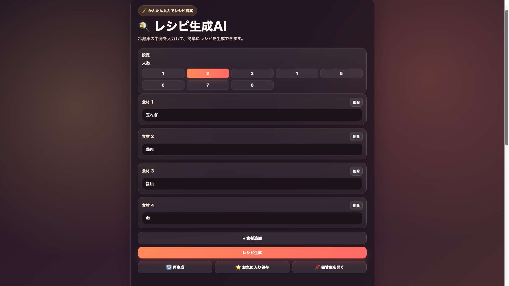
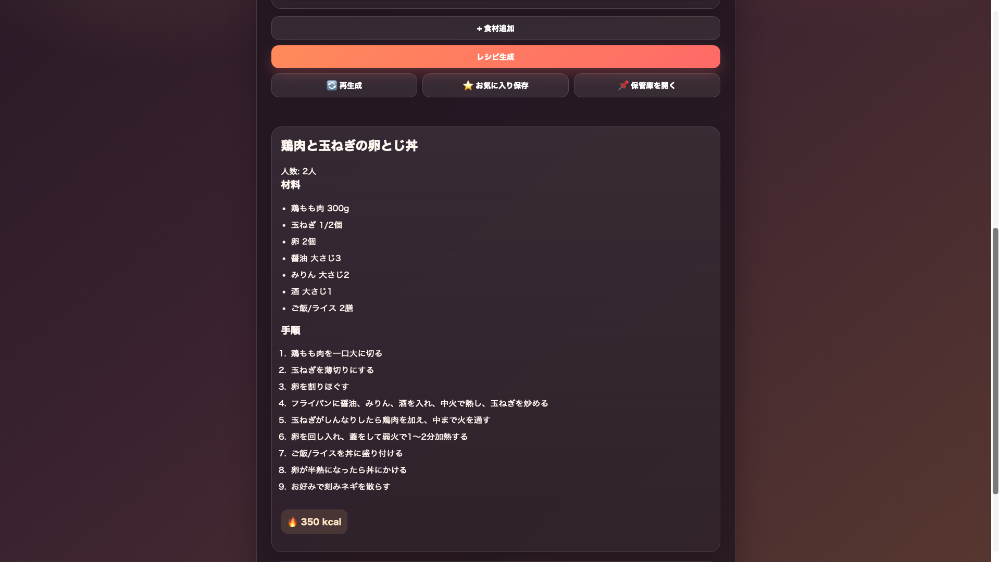
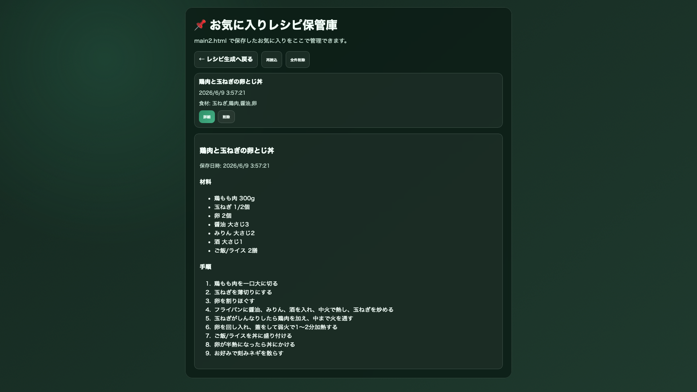

🍳 AIレシピ提案アプリ（ローカルLLM活用）

## 概要
本アプリは、入力された食材からレシピを生成するWebアプリケーションです。
外部APIに依存せず、ローカル環境で動作するLLM（Ollama）を用いてレシピ生成を実現しています。
ユーザーは冷蔵庫の食材を入力するだけで、人数に応じた実用的なレシピ（分量・手順付き）を取得できます。

## 主な機能

- 食材入力によるレシピ生成
- 分量付きレシピ表示（人数対応）
- レシピ候補一覧 / 詳細表示
- 再生成機能（別パターン提案）
- お気に入り保存（localStorage）


## 技術構成

フロントエンド

- HTML / CSS / JavaScript

バックエンド

- FastAPI（Python）

AI生成

- Ollama（ローカルLLM）
- Gemma系モデル

インフラ

- AWS EC2（Ubuntu）


## 工夫したポイント

### 1. ローカルLLMによる完全自立型構成
外部APIに依存せず、EC2上でLLMを直接動作させる構成を採用しました。
これにより、オフライン環境でも動作可能なAIアプリを実現しています。

### 2. プロンプト設計による出力制御

- JSON形式の厳密な指定
- 分量付き材料の強制
- 調理手順の現実性担保

などのルールを設計し、出力品質を安定させました。

### 3. エラー耐性とフォールバック設計

- LLM生成失敗時のフォールバック処理
- APIレスポンス検証
- フロント側での例外処理
uvicorn app:app --host 0.0.0.0 --port 8000
により、ユーザー体験を損なわない設計としています。

### 4. UX考慮（低速環境対応）
ローカルLLM特有の遅延を考慮し、

- ローディング表示
- 再生成機能
- 非同期制御

を実装しています。
推奨: 環境変数を `.env` にまとめ、`.gitignore` に追加してリポジトリに含めないようにしてください。公開リポジトリには `.env.example` のようなサンプルを置き、実値は記載しないでください。


## 課題と対応

### 問題
ローカルLLM（CPU環境）では生成に時間（数分）がかかる

### 対応

- タイムアウト時間の最適化
- 軽量モデルへの切り替え検証
- プロンプト簡略化による高速化


## 今後の開発方針（ロードマップ）

### 1. 性能向上

- インスタンススペック最適化
- モデル軽量化（量子化モデルの利用検討）
- 応答時間短縮

### 2. 対話型レシピ提案

uvicorn app:app --host 0.0.0.0 --port 8000
- 好み・制約条件の反映

### 3. パーソナライズ

- ダイエット / 筋トレ / 時短など目的別提案

### 4. 食材管理機能

- 冷蔵庫の在庫管理
- 消費期限ベースの提案


## セキュリティ

- 入力検証の実装
- エラーハンドリング
- 将来的にレート制限・認証導入予定

## デプロイと実行（簡易手順）

前提: Ubuntu（EC2）にSSHでアクセスでき、Python3がインストールされていること。

1. リポジトリをサーバーに転送またはクローンする

```bash
# 例: ファイル転送と接続（公開前に実際のパスやSSH鍵、実ホスト名を残さないこと）
# ローカル→リモート転送（<LOCAL_PATH> と <REMOTE_USER>@<REMOTE_HOST>:<REMOTE_PATH> を置き換えてください）
scp -r <LOCAL_PATH> <REMOTE_USER>@<REMOTE_HOST>:<REMOTE_PATH>

# リモートへSSH（公開前に秘密鍵パスや実IPを直接書かないでください）
ssh <REMOTE_USER>@<REMOTE_HOST>
cd <REMOTE_PATH>
```

2. Python環境の準備（仮想環境推奨）

```bash
python3 -m venv venv
source venv/bin/activate
pip install --upgrade pip
pip install fastapi uvicorn requests
```

3. Ollama（ローカルLLM）の起動とモデル準備

- Ollamaは別途インストールして起動してください（公式ドキュメント参照）。
- モデル（例: gemma3:4b）をインストールして利用可能にしておきます。

4. サーバー起動

```bash
# 開発テスト
uvicorn app:app --host 0.0.0.0 --port 8000

# 実運用は systemd / pm2 / supervisord などでデーモン化してください
```

注意: README やソース内に以下の情報を残したまま公開しないでください。
- 個人のローカルパス（例: OneDrive のユーザ名や学校名が含まれるパス）
- 実際のホスト名 / IP / SSH 鍵のパス
- API キーや秘密トークン
公開前にこれらをプレースホルダに置き換えることを推奨します。

5. 動作確認

- ブラウザで `http://<EC2_IP>:8000/` にアクセスし、動作を確認します。
- ログは起動端末に出力されます。問題があれば uvicorn のログとサーバーコンソールを確認してください。

## 成果
- EC2上でローカルLLMを用いたレシピ生成アプリを動作させることに成功しました（分量・手順付きレシピ生成、候補一覧、再生成、お気に入り保存を確認）。

## スクリーンショット
アプリのスクリーンショットを以下に掲載します。







## English Summary (short)

AI Recipe Generator (local LLM)

This web app generates cooking recipes from provided ingredients using a local LLM (Ollama). It runs on FastAPI and serves static HTML pages for the frontend. Key features:

- Recipe generation with ingredient quantities per serving
- Multiple recipe candidates and detail view
- Regenerate alternative recipes
- Favorites saved in `localStorage`

Quick start (server):

```bash
# Setup virtualenv, install backend deps
python3 -m venv venv && source venv/bin/activate
pip install fastapi uvicorn requests
# Start server
uvicorn Back.app:app --host 0.0.0.0 --port 8000
```

Notes:
- Ensure Ollama is running locally on the server and the expected model is available.
- Adjust timeouts and model selection for performance on CPU instances.
